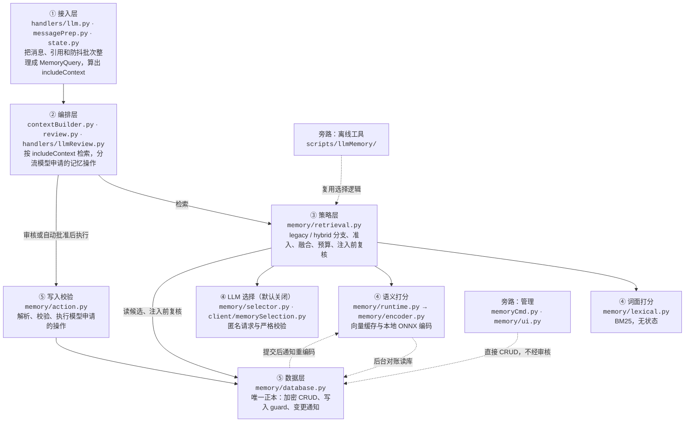

# LLM Memory 系统文档

> 最后更新：2026-09-28
> 
> 我的记忆已经大于我的力量了……！（雾
> 模型要是能有 1B 上下文的话……就可以力大砖飞不用搞这么复杂了……💦
> 
> Written by ZincNya~ ❤

---

## 系统概述

LLM Memory 是 Bot 的长期记忆系统，负责存放对话里值得留下的事实——用户偏好、约定、需要跨对话复用的信息，比如「用户很讨厌香菜」「这个群每周五晚上一起打游戏」这些……

LLM 本身是无状态的，每次调用都从零开始。如果把所有东西都塞进聊天历史，很快会超出上下文长度，无关的信息也会拖累回复质量。所以应该把值得记住的事实单独存放，需要时再取出来给 LLM——这就是 Memory 子系统的职责。

LLM Memory 有别于聊天历史、知识库：

| | 聊天历史 | 知识库 | Memory |
| --- | --- | --- | --- |
| 内容 | 原始消息流 | Bot 的固定背景知识 | 从对话里浓缩出的事实 |
| 谁写入 | Bot 处理过的消息自动落库 | 开发者维护 `data/llm/knowledge/` 下的 Markdown | 模型申请（默认经审核）或管理员命令 |
| 能否修改 | 只追加，超过条数上限时归档并删除最旧的消息 | 改源文件后重建索引 | 随时增、删、改 |
| 存储 | `data/chatHistory.db` | `data/llm/knowledge.db` | `data/llm/llmMemory.db` |

---

## 快速导航

LLM Memory 在重构之后已经变成了比较复杂的系统，文档略长。可能有下面的列表更能辅助阅读——

| 你想做什么 | 从这里开始 | 关键入口 |
| --- | --- | --- |
| 快速了解一次请求怎么用到记忆 | [核心工作流程](#核心工作流程) | `contextBuilder.py` |
| 查看一条记忆包含哪些字段 | [数据模型](#数据模型) | `memory_entries` 表 |
| 理解记忆是怎么被选中的 | [检索原理](#检索原理) → [Hybrid 详细文档](llm-memory-hybrid.md) | `retrieval.py` |
| 在控制台添加、编辑、删除记忆 | [控制台命令](#控制台命令) | `/llm memory add`、`/llm memory edit` |
| 处理模型申请的记忆操作 | [写入与审核](#写入与审核) | `review.py`、`action.py` |
| 启用、评测和验收混合检索 | [Hybrid 详细文档](llm-memory-hybrid.md) | 模型安装、calibration、验收门槛 |
| 排查问题 | [常见问题](#常见问题) | `/llm memory status` |

相关文档：
- [LLM 上下文组装](llm-context-assembly.md)——记忆块怎样和知识库、历史一起拼进 prompt
- [LLM Handler 架构](llm-handler.md)——从收到消息到发出回复的完整流水线
- [LLM Knowledge Base](llm-knowledge.md)——Bot 的知识库系统

---

## 目录

- [系统概述](#系统概述)
- [快速导航](#快速导航)
- [架构总览](#架构总览)
- [核心概念](#核心概念)
- [核心设计决策](#核心设计决策)
- [核心工作流程](#核心工作流程)
- [数据模型](#数据模型)
- [检索原理](#检索原理)
- [写入与审核](#写入与审核)
- [控制台命令](#控制台命令)
- [API 接口](#api-接口)
- [常见问题](#常见问题)
- [已知局限](#已知局限)

---

## 架构总览

Memory 并不是一个独立的服务，它由一个 SQLite 正本和一套「本轮选哪些记忆进 prompt」的逻辑组成，挂在原有的回复链路上。legacy 和 hybrid local 都不产生额外的 LLM 调用；只有在 hybrid 模式中显式启用 llm 选择后端，才会多一次远程请求。

下图按「谁能调用谁」分成五层，另有两条旁路。图中的 `memory/`、`client/` 指 `utils/llm/` 下的子目录。



实线是线上请求的调用方向，只能从上往下走。跨层调用会绕过那一层的保护：绕过审核直接写库，或者绕过 `retrieval.py` 自己拼记忆块，都属于这种情况。

虚线是后台路径和旁路：

- **索引**：`database.py` 提交成功后，通知 runtime 重编码这条记忆。它通过 `stateManager` 拿已注册的实例，不 import `runtime.py`，所以没有 runtime 时写入照常完成；通知失败只记日志，不回滚（`database.py:_notifyMemoryChanged`）。runtime 的后台 worker 只在 hybrid 模式下工作。对账时按每页 128 条（`LLM_MEMORY_INDEX_PAGE_SIZE`）连续读完一轮，两轮之间间隔 30 秒（`LLM_MEMORY_RECONCILE_SECONDS`）。
- **管理**：控制台命令和管理界面直接调用数据库 CRUD，不经审核。新增时默认写成 `source=manual`，模型不能修改或删除 manual 记忆；CLI 的 `add` / `edit` 也可以用 `-source` 显式写成 `inferred`，之后模型就能改删它。
- **离线工具**：`scripts/llmMemory/` 的评测脚本复用线上的查询构造、打分和预算代码，输入换成人工标注的 fixture，不读生产数据库。

两条规则贯穿全层：

1. **SQLite 是唯一正本。** 向量缓存是派生数据，丢了可以从数据库重建——重启后清空，hybrid 模式下 runtime 会在后台按容量尽力补回。审核队列只在进程内存里，内容来自模型输出，重启后连同旧审核卡一起丢失——而数据库不受影响。
2. **选择只发生在检索入口。** 哪些记忆进 prompt，只由 `retrieveMemoryContext()` 决定，阈值、融合、预算和注入前复核都在 `retrieval.py`（legacy 的配额排序是 `database.py` 里的纯函数，生产代码只从这个入口调用）。上层只构造输入，原样放入返回的 `contextBlock`；下层只打分或读写。`database.py` 还保留着旧接口 `retrieveMemories()` 和 `buildMemoryContextBlock()`，经 `utils.llm` 导出，目前只有测试在用；新代码应调用 `retrieveMemoryContext()`。

### 关键文件职责

| 文件 | 职责 |
| --- | --- |
| `utils/llm/memory/types.py` | 数据结构：`MemoryTurn`、`MemoryQuery`、`MemoryRetrievalResult`、`MemoryWriteGuard`，以及内容指纹、状态指纹两种指纹 |
| `utils/llm/memory/database.py` | 唯一的读写入口：加密 CRUD、写入 guard 比对、提交后通知 runtime |
| `utils/llm/memory/retrieval.py` | 检索入口 `retrieveMemoryContext()`：legacy / hybrid 分支、准入、融合、预算、注入前复核 |
| `utils/llm/memory/lexical.py` | 中文 2-gram 加英数整词的 BM25 |
| `utils/llm/memory/encoder.py` | 加载固定版本的本地 ONNX 模型，编码 base / enhanced 两种表示 |
| `utils/llm/memory/runtime.py` | 进程内语义运行时：向量缓存、后台索引与对账 |
| `utils/llm/memory/selector.py` | LLM 选择后端的协议：构造候选和匿名请求，严格核验返回的 ID |
| `utils/llm/client/memorySelection.py` | LLM 选择后端的单次异步传输，不复用主生成的重试链路 |
| `utils/llm/memory/action.py` | 解析 `<MEMORY_ACTION>`，校验并执行模型申请的写入 |
| `utils/llm/review.py` | 把模型的记忆操作分流到自动执行、控制台审核队列或 Telegram 审核卡 |
| `handlers/llmReview.py` | Telegram 审核卡：按钮回调、`:edit` 编辑、`:fb` 反馈重试，以及 bot_data 里审核状态的过期清理 |
| `utils/llm/contextBuilder.py` | 按 `includeContext` 检索记忆，把记忆块放进 prompt 的低信任层 |
| `utils/command/llm/memoryCmd.py` | 控制台 `/llm memory` 命令 |
| `utils/llm/memory/ui.py` | `/llm memory ui` 管理界面 |
| `utils/core/schema/llmMemory.sql` | `memory_entries` 表结构 |
| `scripts/llmMemory/` | 离线工具：模型安装、评测和研究脚本，见其 [README](../scripts/llmMemory/README.md) |

---

## 核心概念

Memory 系统中，有以下将会反复提到的概念——

### Scope（作用域）

Scope 决定一条记忆在哪些对话里可见。检索时读取 `global`，加上当前请求所属的 chat、user、session 三类 scope（`database.py:getMemoryCandidates`）：

| Scope | `scope_id` | 什么时候可见 | 示例 |
| --- | --- | --- | --- |
| `global` | 固定为 `global` | 所有对话 | 「偏好简体中文」 |
| `chat` | chat ID | 这个聊天里的请求 | 「这个群每周五晚上一起打游戏」 |
| `user` | 用户 ID | 这个用户触发的请求，不论在哪个聊天 | 「用户很讨厌香菜」 |
| `session` | 会话 ID | 带有相同 session ID 的请求 | 目前没有任何生产路径传入 session ID，这类记忆读不到 |

user scope 按触发请求的人判断：同一个群里其他成员的 user 记忆，不会因为同在一个群就被读到。

模型只能写 `global`、`chat`、`user` 三类。写 chat/user 时，`scope_id` 必须和当前请求的身份一致，否则直接拒绝（`action.py:_validateActionScopeAuthorization`）。session 记忆只能由管理员写入。

### Source（来源）

| Source | 谁写入 | 模型能否修改 |
| --- | --- | --- |
| `manual` | 管理员命令或管理界面，新增时的默认值 | 不能 |
| `inferred` | 模型申请，经审核或自动批准后执行 | 能 update / delete |

模型发起的 update / delete 如果指向非 `inferred` 的记忆，会在校验阶段被拒绝（`action.py:validateAction`）。管理员可以用 CLI 的 `-source` 显式指定来源，写成 `inferred` 后模型就能改删这条记忆。

### Mode（记忆模式）

| Mode | 检索行为 | 适合放什么 |
| --- | --- | --- |
| `contextual`（默认） | 参与选择：legacy 按 priority 配额取，hybrid 按相关性准入 | 大部分记忆 |
| `pinned` | 不参与相关性竞争，检索读到候选后直接放进「常驻记忆」段 | 每轮都可能用到、又短又稳定的事实 |

常驻段最多 1000 字符（`LLM_MEMORY_PINNED_MAX_CHARS`），整个记忆块最多 2500 字符（`LLM_MEMORY_CONTEXT_MAX_CHARS`）。放不下的条目整条跳过，不会截断。

检索提前返回时，pinned 也不会注入：并发名额已满、正在关停、选择配置无效、llm 后端下 runtime 未注册，或读库失败（`retrieval.py:retrieveMemoryContext`）。

pinned 仍在低信任块里，身份设定和安全规则应该写进 system prompt，不要放在这里。模型新增、修改、升降级或删除 pinned，都必须人工审核。

### Priority（优先级）

取值 0-3，默认 0，上限由 `LLM_MEMORY_PRIORITY_CAP` 限定。每一档的含义只在写给模型的格式说明里约定（`_guardrails.py:MEMORY_ACTION_INSTRUCTIONS`）：

| 值 | 约定含义 |
| --- | --- |
| `0` | 日常闲聊 |
| `1` | 一般偏好 |
| `2` | 重要事实 |
| `3` | 关键信息 |

代码只校验范围，不判断一条记忆该不该是 3，填多少由写入的模型或管理员决定。

priority 在不同路径里的作用不一样：

| 路径 | priority 的作用 |
| --- | --- |
| legacy 的 contextual | 主排序键，决定能否进每 scope 20 条、合计 10 条的配额 |
| hybrid local 的 contextual | 只在融合分相同时决胜，不影响准入 |
| hybrid llm 的 contextual | 不参与，顺序由模型返回的 `primaryOrder` 决定 |
| pinned | 决定装入常驻段的先后，预算不够时排在后面的条目更容易被跳过 |

它还会以 `w=` 的形式印在记忆块里，见[核心工作流程](#核心工作流程)。

### RetrievalHint（检索说明）

可选字段，单行，最多 80 字（`LLM_MEMORY_HINT_MAX_CHARS`），和正文一样加密存储。它描述这条记忆以后可能以什么说法、别名或话题被提到，不能补充正文里没有的事实：

```json
{
  "content": "用户在备考研究生",
  "retrievalHint": "研究生备考、复习安排、考研"
}
```

它的作用范围很窄：只在 hybrid local 的两个语义通道里，给已经凭正文和标签过了阈值的记忆调整名次。它不进 BM25，不影响 llm 选择后端的候选池，也不会发给选择模型或出现在 prompt 里；legacy 完全不用它。原因见[为什么一条记忆要编码两个向量](#为什么一条记忆要编码两个向量)。

hint 跟着正文走（`database.py:updateMemory`）：

- 正文或标签变了、又没给新 hint 时，旧 hint 自动清除；
- 显式传空字符串表示清除，不传表示保留；
- 模型提交的 hint 有换行或超长时，解析阶段只丢弃 hint 并记一条警告，操作的其余部分照常校验（`action.py:_parseActionDict`）；如果这是一条只改 hint 的 update，丢弃后没有可改的字段，整条会被拒绝。

---

## 核心设计决策

### 为什么不全部塞进 System Prompt

System prompt 更适合放固定的身份、安全约束和行为规则。把动态记忆永久塞进去会有三个问题：

1. **无法区分 scope** — global / chat / user 的边界会模糊
2. **上下文膨胀** — 无关信息会降低模型生成质量
3. **难以在线编辑** — 修改记忆需要改配置文件

所以记忆独立存储，**按需检索**，并受固定字符预算限制（默认 pinned 1000 + contextual 1500 = 2500 字符）。

### 为什么不直接用聊天历史

聊天历史（`chatHistory.db`）记录完整对话，包含大量无关信息：

1. **信息密度低** — 一句"我喜欢咖啡"可能淹没在 100 轮闲聊里
2. **无结构化能力** — 无法标记"这是用户偏好""这是临时事实"
3. **难以编辑** — 用户改变偏好时，无法修改历史对话

Memory 是**浓缩的、结构化的、可编辑的事实**。

### 为什么需要 Hybrid 混合检索

旧检索（Legacy）有两个致命缺陷：

1. **候选缺失** — 按 priority 截断后取每 scope 20 条、合计 10 条，低优先级但相关的记忆无法参与判断
2. **无相关性判断** — 不计算记忆与查询的相关性，只按 priority 机械排序注入

Hybrid 通过**混合检索（语义 + 词面）+ RRF 融合**解决这两个问题。详见 [Hybrid 详细文档](llm-memory-hybrid.md)。

### 为什么一条记忆要编码两个向量

语义检索要先把文本变成向量才能比对相似度。一条记忆通常有两份可编码的文本：正文 `content` 是事实本身，`retrievalHint` 是人工补的检索扩展词。

如果把两者拼在一起编码成一个向量，hint 就会顺带影响「这条记忆该不该被选中」——而它本该只影响「选中后排第几」。

所以拆成两个向量，各司其职：

| 表示 | 编码内容 | 用在哪一步 |
| --- | --- | --- |
| `base` | 正文 + 标签 | 准入：跟阈值比，决定有没有资格进候选 |
| `enhanced` | 正文 + 标签 + hint | 排序：只给已过 base 阈值的记忆调名次 |

约束是 `enhanced` 只能重排 `base` 放行的那批 ID，一条都不能新增。

**具体场景：**

若有：
- 记忆 A：`content="用户喜欢喝咖啡"`，`hint="咖啡、拿铁、美式、卡布奇诺、星巴克、瑞幸、咖啡因"`
- 记忆 B：`content="用户对咖啡过敏，绝对不能喝含咖啡因的饮料"`，无 hint

用户问「推荐个饮料」。A 的正文单看只是一句无关偏好，但塞满咖啡词的 hint 会把向量往「饮品」方向拽，分数可能反超 B。于是 A 过阈值、B 没过，模型拿到的记忆只剩「用户喜欢喝咖啡」——于是推荐了咖啡，但用户过敏。

反过来看 hint 该起作用的场景：

记忆 `content="用户在备考研究生"`、`hint="研究生备考、复习安排、考研"`。用户问「考研复习得怎么样」，正文里没有「考研」二字，base 可能让它过关，hint 帮它在候选里排得更靠前——这就是排序而不是准入了。

完整的编码流程、分块策略和缓存机制见 [Hybrid 详细文档](llm-memory-hybrid.md)……

---

## 核心工作流程

一次完整的"用户发消息 → Bot 调用 Memory → 生成回复"流程：

### 1. 用户发消息

```
用户：明天提醒我开会
```

### 2. Handler 检测到需要 LLM 处理

`handlers/llm.py` 检测到这是需要 LLM 处理的消息，准备生成回复。

### 3. 检索相关记忆

`utils/llm/contextBuilder.py` 调用 `utils/llm/memory/retrieval.py`：

```python
from utils.llm.memory.retrieval import retrieveMemoryContext
from utils.llm.memory.types import MemoryQuery, MemoryTurn

# 查询结构
query = MemoryQuery(
    turns=(MemoryTurn(currentText="明天提醒我开会"),),
    history=recentHistory  # 近期聊天历史（最多 20 条、30 分钟内、600 字）
)

# 执行检索
result = await retrieveMemoryContext(query=query, chatID=chatID, userID=userID)
# result.items = [相关的记忆列表]
# result.contextBlock = 渲染好的 <UNTRUSTED_MEMORY> 块
```

**检索过程（Legacy 模式）：**
1. 从数据库读取所有 `enabled=1` 且 scope 匹配的记忆
2. 按 `priority > scope 专属度 > updated_at > id` 降序排序，每个 scope 取前 20 条，汇总后取前 10 条
3. 按字符预算裁剪（整块 2500 字符，其中 pinned 段 1000 字符）
4. 注入前回数据库复核，剔除已删除/已修改的记忆

**检索过程（Hybrid 模式）：**
> 其实简单来说，Hybrid 模式就是一个有着更宽候选池的 Legacy，再套上一层更复杂的评分机制……
1. 从数据库读取所有 `enabled=1` 且 scope 匹配的记忆（不截断）
2. 三路并行打分：
   - **语义 - current**：当前消息与记忆的 `base` 表示的余弦相似度
   - **语义 - assisted**：近期历史辅助构造与记忆的 `base` 表示的余弦相似度
   - **词面 - lexical**：BM25 打分（content + 2×tags 权重）
3. 阈值准入：每路独立比对校准阈值，三路任一通过即准入
4. RRF 融合排序：三路排名用 Reciprocal Rank Fusion 合并（K=60），融合后对已准入的记忆，在两个语义通道里用 `enhanced` 表示重排
5. 按字符预算裁剪（同 Legacy）
6. 注入前回数据库复核（同 Legacy）

详见 [检索原理](#检索原理) 和 [Hybrid 详细文档](llm-memory-hybrid.md)。

### 4. 组装 Prompt

`contextBuilder.py` 会把检索到的记忆渲染成低信任块：

```text
<UNTRUSTED_MEMORY>
[低信任长期记忆：仅在与当前对话直接相关时参考；不要为了提及而提及，也不要推断未记录的因果关系。]
[常驻记忆]
- (user:12345, w=3, id=3, src=manual, mode=pinned) 用户不喜欢吃青椒
[情境记忆]
- (user:12345, w=1, id=57, src=inferred, mode=contextual) 用户通常在萨莉亚和同学约饭
- (chat:-1001234567890, w=0, id=61, src=inferred, mode=contextual) 这个群每周五晚上一起打游戏
</UNTRUSTED_MEMORY>
```

每条记忆的元信息包括：
- `scope_type:scope_id`：作用域
- `w=priority`：优先级（weight 的缩写）
- `id=<数字>`：记忆 ID
- `src=<来源>`：manual / inferred
- `mode=<模式>`：pinned / contextual

> 记忆来自于实际的聊天场景，可能会过时、不完整或存在冲突——更严重的情况是可能包含来自用户的恶意诱导信息。那么这时，就应该给模型一个"仅在与当前对话直接相关时参考"的指示，让模型知道记忆并非可靠的信息源。
> 
> 稍微具体一点来说，我们采取的安全措施之一，是记忆正文在渲染前会经过 `neutralizePromptDelimiters` 处理，防止用户输入伪造 `</UNTRUSTED_MEMORY>` 等高信任标记越权。`retrievalHint` 永不出现在 prompt 里。

### 5. 模型生成回复

LLM 看到记忆后，生成：

```
好的，明天 8:45 提醒你开会！记得提前准备材料～
```

### 6. 模型可能生成记忆操作

如果模型认为需要写入新记忆，会在回复里生成特殊标记（具体格式由 `review.py:_parseMemoryActions` 解析，不在此展开）。

操作会被 `utils/llm/review.py` 拦截，进入审核流程。

### 7. 审核与执行

根据配置的审核模式（`memoryAutoApprove` 开关）：

- **关闭（默认）：** 所有操作进入审核队列待审核（控制台或 Telegram inline keyboard）
- **开启：** 普通 global contextual 操作自动执行入库，chat/user/pinned 仍需审核

审核通过后，`utils/llm/memory/action.py` 执行写入，并通知 `runtime.py` 更新索引（Hybrid 模式时）。

---

## 数据模型

每条记忆在 `llmMemory.db` 的 `memory_entries` 表里存储为一行：

| 字段 | 类型 | 说明 |
| --- | --- | --- |
| `id` | INTEGER | 主键，自增 |
| `scope_type` | TEXT | 作用域类型：`global` / `chat` / `user` / `session` |
| `scope_id` | TEXT | 作用域 ID（chat/user 时为对应的 Telegram ID） |
| `content` | BLOB | **加密**正文（Fernet，密钥在 `data/.chatKey`） |
| `tags_json` | TEXT | JSON 数组，如 `["日程", "会议"]` |
| `priority` | INTEGER | 优先级 0-3 |
| `mode` | TEXT | 检索模式：`contextual` / `pinned` |
| `retrieval_hint` | BLOB | **加密**检索提示（可选） |
| `source` | TEXT | 来源：`manual` / `inferred` |
| `enabled` | INTEGER | 是否启用（0 / 1） |
| `created_at` | DATETIME | 创建时间戳 |
| `updated_at` | DATETIME | 更新时间戳 |

**加密机制：** `content` 和 `retrieval_hint` 用 `cryptography.fernet.Fernet` 加密，密钥存在 `data/.chatKey`（首次运行时自动生成）。这确保即使数据库文件泄露，正文也无法直接读取。在此，其实有**三库共用一把密钥**，即 `chatHistory.db`、`llmMemory.db`、`todos.db` 共用 `data/.chatKey` 的操作……~~这大概是因为不用同一把密钥的话太麻烦了~~

**Schema 迁移：** `mode` 和 `retrieval_hint` 是后加的字段。旧数据库会在初始化时自动添加列（`database.py:_initSchema`），默认值为 `contextual` 和 `NULL`。

**示例记忆：**

```python
{
    "id": 42,
    "scope_type": "user",
    "scope_id": "123456789",
    "content": "用户讨厌香菜",  # 实际存储时已加密
    "tags_json": '["偏好", "食物"]',
    "priority": 3,
    "mode": "pinned",
    "retrieval_hint": "香菜、蔬菜、讨厌的食物",  # 实际存储时已加密
    "source": "manual",
    "enabled": 1,
    "created_at": "2026-09-20 10:30:00",
    "updated_at": "2026-09-20 10:30:00"
}
```

---

## 检索原理

Memory 检索分两种模式：**Legacy**（默认，按 priority 配额）和 **Hybrid**（语义+词面混合）。

### Legacy 检索（默认）

**流程：**

1. **读取候选池：** 从数据库读取所有 `enabled=1` 且 scope 匹配的记忆
2. **优先级截断：** 按 `priority > scope 专属度 > updated_at > id` 降序排序，每个 scope 取前 20 条，汇总后取前 10 条
3. **按字符预算裁剪：** 整块最多 2500 字符，其中 pinned 段最多 1000 字符
4. **去重：** 按 `(scope_type, scope_id, 正文)` 去重（保留排序靠前的）
5. **注入前复核：** 回数据库查一遍，剔除已删除/已修改（指纹不匹配）的记忆

**特点：** 不打分，只靠 priority 决定谁进配额。相关但 priority 低的记忆会被挤出候选池。

### Hybrid 检索

**流程：**

1. **读取候选池：** 从数据库读取所有 `enabled=1` 且 scope 匹配的记忆（不截断）
2. **三路并行打分：**
   - **语义 - current**：当前消息的向量 vs 记忆 `base` 表示的余弦相似度
   - **语义 - assisted**：当前消息 + 近期历史（最多 20 条、30 分钟内、600 字）的向量 vs 记忆 `base` 表示的余弦相似度
   - **词面 - lexical**：BM25（中文 2-gram + 英数整词，`content + 2×tags` 权重）
3. **阈值准入：** 每路独立比对校准阈值（`retrievalCalibration.json`），三路任一通过即准入
4. **RRF 融合 + enhanced 重排：** 
   - 三路排名用 Reciprocal Rank Fusion 合并（K=60）：`score = Σ (1 / (60 + rank))`
   - 对已准入的记忆，在两个语义通道里用 `enhanced` 表示（content + tags + hint）重排
   - 打平时用 `priority > scope 专属度 > updated_at > id` 兜底
5. **按字符预算裁剪、去重、注入前复核：** 同 Legacy

**特点：** 候选池更宽，准入靠相关性而非 priority。详见 [Hybrid 详细文档](llm-memory-hybrid.md)。

如果选择后端配置为 LLM Selector，才会额外调用独立的 LLM API；它的候选构造、句柄校验和数据库 ID 恢复流程见 [Hybrid 详细文档](llm-memory-hybrid.md#llm-selector可选)。local 后端不会执行这一步。

可以在控制台中通过命令来切换检索模式：`/llm memory retrieval legacy|hybrid`

---

## 写入与审核

记忆的写入有两个来源：

1. **控制台命令：** 管理员直接通过 `/llm memory add` 等命令写入（立即生效，无需审核）
2. **模型申请：** LLM 在生成回复时附带记忆操作（需审核）

### 模型申请的操作格式

模型会在回复里生成特殊标记（由 `review.py:_parseMemoryActions` 解析）。具体格式不在文档展开，但支持三种操作：

- `add`：新增记忆
- `update`：修改已有记忆
- `delete`：删除记忆

### 审核模式

由 `memoryAutoApprove` 开关控制（`/llm memory -autoapprove` 切换）：

#### 关闭（默认）

所有操作进入审核队列：
- **控制台模式：** `/llm review` 进入交互式审核界面
- **Telegram 模式：** Bot 发送审核卡，ops 点击按钮或用 `:edit` 编辑

审核队列在 `StateManager` 的进程内存里（`review.py:getReviewQueue()`），Bot 重启后清空。审核条目 TTL 24 小时（`LLM_REVIEW_TTL_SECONDS`），过期自动移除。

#### 开启

**有意收窄的自动批准策略：** 只允许普通 global contextual 操作自动执行，其他仍需审核：

- ✅ 自动批准：`scope=global` + `mode=contextual`（或 `add` 时 `mode=None`）
- ❌ 需审核：
  - `scope=chat` 或 `scope=user`（即使 `mode=contextual`）
  - `mode=pinned`（新增、升级、修改、删除）
  - 未知 mode（防止未来格式误当安全默认值）

自动批准失败的操作会退回审核队列（`review.py:dispatchMemoryActions`），给 ops 一次重试或取消的机会。

**为什么这样设计？** 模型目前几乎总把记忆写入 global，普通 global contextual 可以减少审核延迟；chat/user 与 pinned 仍必须让 ops 确认，避免扩大修改面。

### 执行与验证

审核通过后，`action.py:executeAction` 执行写入：

1. **Scope 校验：** 检查 chat/user scope 是否在当前请求的上下文内（防止跨群写入）
2. **字段验证：** `priority` 必须 0-3，`mode` 必须 `contextual`/`pinned`
3. **Update/Delete 前置检查：** 目标记忆必须存在且未被保护
4. **数据库事务：** 写入成功后通知 Runtime 更新索引（Hybrid 模式时）
5. **日志记录：** 操作结果写入系统日志

### Hint 失效规则

`retrievalHint` 是正文/标签的"语义缓存辅助"：
- 显式传空字符串 `""` → 清除
- 省略 → 保留旧值
- **正文或标签变化 → 旧 hint 自动失效**（防止过时提示继续导流）

实现见 `database.py:updateMemory`。

---

## 控制台命令

所有命令在 `utils/command/llm/memoryCmd.py`。

### 基础命令

```bash
# 查看当前配置和统计
/llm memory status

# 列出所有启用的记忆（默认）
/llm memory list

# 列出所有记忆（含禁用）
/llm memory list -all

# 按 scope 过滤
/llm memory list -scope user -id 123456789

# 限制条数
/llm memory list -limit 20

# 切换检索模式
/llm memory retrieval legacy    # 切换到 Legacy
/llm memory retrieval hybrid    # 切换到 Hybrid

# 切换自动批准
/llm memory -autoapprove        # 开关普通 global contextual 自动批准
```

### 增删改

```bash
# 新增记忆
/llm memory add -scope global -text "人类晚上会睡觉"
/llm memory add -scope user -id 123456789 -text "用户讨厌青椒" -tags 青椒 蔬菜 -priority 3 -mode pinned

# 编辑记忆
/llm memory edit -mid 42 -text "用户讨厌青椒"
/llm memory edit -mid 42 -priority 3 -mode pinned
/llm memory edit -mid 42 -hint "青椒、蔬菜、讨厌的食物"
/llm memory edit -mid 42 -clearhint              # 清除 hint
/llm memory edit -mid 42 -enabled off            # 禁用

# 删除记忆
/llm memory del 42
```

**参数说明：**

| 参数 | 必选 | 说明 | 别名 |
| --- | --- | --- | --- |
| `--scope` | 是（add） | `global` / `chat` / `user` / `session` | `-s` |
| `--id` | 条件必选 | scope 为 chat/user 时必填（Telegram ID） | `-i` |
| `--text` | 是（add） | 记忆正文 | `-t` |
| `--tags` | 否 | 标签列表（空格分隔） | `-g` |
| `--priority` | 否 | 优先级 0-3，默认 0 | `-p` |
| `--mode` | 否 | `contextual` / `pinned`，默认 `contextual` | `-m` |
| `--hint` | 否 | 检索提示（Hybrid 专用） | `-h` |
| `--off` | 否 | 创建时直接禁用（add 专用） | `-o` |
| `--mid` | 是（edit） | 要编辑的记忆 ID | `-m` |
| `--enabled` | 否 | `on` / `off`（edit 专用） | `-e` |
| `--clearhint` | 否 | 清除 hint（edit 专用） | 无 |

### 管理界面

```bash
/llm memory ui
```

打开 TUI（文本用户界面），可视化管理记忆（浏览、搜索、编辑、删除）。实现见 `memory/ui.py`。

---

## API 接口

### 检索

```python
from utils.llm.memory.retrieval import retrieveMemoryContext
from utils.llm.memory.types import MemoryQuery, MemoryTurn

query = MemoryQuery(
    turns=(
        MemoryTurn(currentText="用户当前消息"),
        # 可选：MemoryTurn(replyText="Bot 的回复", currentText="用户追问")
    ),
    history=[
        {"role": "user", "content": "..."},
        {"role": "assistant", "content": "..."},
    ]
)

result = await retrieveMemoryContext(
    query=query,
    chatID=-1001234567890,
    userID=123456789,
    sessionID=None,  # 可选
)

# result.items: list[dict]  # 记忆列表
# result.contextBlock: str  # 渲染好的 <UNTRUSTED_MEMORY> 块
# result.diagnostics: dict  # 检索诊断（超时、降级原因等）
```

### 数据库操作

```python
from utils.llm.memory.database import (
    addMemory,
    updateMemory,
    deleteMemory,
    getMemoryByID,
    getMemories,
)

# 新增
memoryID = await addMemory(
    scopeType="user",
    scopeID="123456789",
    content="用户对花生过敏",
    tags=["健康", "饮食"],
    priority=3,
    mode="pinned",
    source="manual",
)

# 查询
memory = await getMemoryByID(memoryID)
memories = await getMemories(
    scopeType="user",
    scopeID="123456789",
    enabledOnly=True,  # 只返回启用的
)

# 更新
success = await updateMemory(
    memoryID,
    content="用户讨厌青椒的味道和口感",  # None = 不修改
    tags=["青椒", "蔬菜", "讨厌的食物"],
    priority=3,
    enabled=True,
)

# 删除
success = await deleteMemory(memoryID)
```

### 记忆操作审核

```python
from utils.llm.memory.action import executeAction, validateAction
from utils.llm.memory.types import MemoryAction, MemoryActionContext

action = MemoryAction(
    action="add",
    scopeType="global",
    scopeID=None,
    content="Bot 的由 Python 写就",
    tags=["技术栈"],
    priority=2,
    mode="contextual",
    source="inferred",
)

context = MemoryActionContext(chatID=-1001234567890, userID=123456789)

# 验证（不执行）
isValid, reason = await validateAction(action, context=context)

# 执行（已审核通过）
success = await executeAction(action, humanApproved=True, actionContext=context)
```

---

## 常见问题

### 为什么检索不到我刚添加的记忆？

1. **检查是否启用：** `/llm memory list -all` 查看该记忆的 `enabled` 是否为 1
2. **检查 scope 匹配：** 记忆的 scope 是否覆盖当前对话？
   - `global`：所有对话可见
   - `chat`：只在该群组可见
   - `user`：该用户在任何对话都可见
3. **检查字符预算：** Priority 更高的记忆可能占满了预算（pinned 1000 + contextual 1500）
4. **检查相关性（Hybrid）：** 记忆正文是否与查询语义/词面相关？用 `/llm memory status` 查看诊断

### Hybrid 检索为什么没有 contextual 记忆？

检查 `/llm memory status` 的诊断信息：

- **Runtime：运行中；编码器未就绪** → 模型未就绪，运行 `python scripts/llmMemory/memoryModel.py install`
- **calibration 不可用** → local Hybrid 会 fail-closed，只保留 pinned，不会自动退回 Legacy；需要已批准且与当前模型、编码版本和词面版本匹配的校准文件，见 [Hybrid 详细文档](llm-memory-hybrid.md)
- **Runtime：未注册** → Runtime 未初始化，检查日志
- **对账容量：已饱和** → 向量缓存已满（32 MiB），冷条目暂不编码

### 如何备份记忆？

```bash
# 备份数据库文件
cp data/llm/llmMemory.db data/llm/llmMemory.db.backup

# 同时备份密钥（解密需要）
cp data/.chatKey data/.chatKey.backup
```

恢复时两个文件一起恢复。不过，密钥不匹配会导致解密失败。

### 记忆写入失败，日志显示 "scope 校验失败"

`chat` 和 `user` scope 的写入必须在对应的上下文内：
- `chat` 记忆只能在该群组的对话中写入
- `user` 记忆只能在与该用户的对话中写入

`global` 记忆无此限制。

### 如何清空所有记忆？

**⚠️ 危险操作，不可逆！**

```bash
# 方法 1：删除数据库文件（重启后自动重建空库）
rm data/llmMemory.db

# 方法 2：SQL 清空表（保留 schema）
sqlite3 data/llmMemory.db "DELETE FROM memory_entries;"
```

### Runtime 诊断里的 lastReason 是什么？

在记忆读取出错时，会出现最近一次 Runtime 降级的原因码，其中有：

- `matrixTooLarge`：向量矩阵超过 8192 条上限
- `reconcileCapacity`：对账容量饱和
- `indexQueueFull`：索引队列已满（32 条上限）
- `queryTimeout`：查询超时（2 秒）
- `queryQueueFull`：查询队列已满（4 条并发上限）

对于上面列出的 Runtime 原因，这表示本次跳过语义检索，词面通道和 pinned 记忆仍可用；这不适用于 calibration 无效，因为 local Hybrid 在校准无效时会关闭全部 contextual 通道。

---

## 已知局限

1. **Legacy 检索：**
   - 候选按 priority 截断，低优先级但相关的记忆无法参与
   - 纯词面匹配，换种说法可能召回失败
   - **解决方案：** 切换到 Hybrid 检索（需完成校准）

2. **Hybrid 检索：**
   - 当前 calibration 为 `unconfigured`，local 后端暂不放行 contextual 记忆；历史实验指标不代表当前线上状态
   - LLM Selector 是独立的远程路径，单次选择最多等待 30 秒，并且存在网络或服务失败风险
   - 向量缓存预算 32 MiB，大量记忆时容量饱和会跳过冷条目

3. **通用限制：**
   - 字符预算固定（整块 2500 字符，其中 pinned 段 1000 字符），无法按对话动态调整
   - 去重只看正文，同一事实的不同表述可能并存
   - 记忆过期没有自动清理机制（需手动删除或禁用）
   - 审核队列只在内存，Bot 重启后，待审核操作会丢失

4. **安全限制：**
   - `chat` 和 `user` scope 的写入必须在对应上下文内（防止跨群写入）
   - Pinned 记忆的新增、升级、修改、删除必须人工审核（即使开启自动批准）

---

## 扩展阅读

- **[Hybrid 详细文档](llm-memory-hybrid.md)** — 混合检索的算法原理、实验数据、启用流程、验收门槛
- **[LLM 上下文组装](llm-context-assembly.md)** — Memory 块怎样和 Knowledge、History、URL 一起组装进 prompt
- **[LLM Handler 架构](llm-handler.md)** — 从收到消息到发出回复的完整流水线
